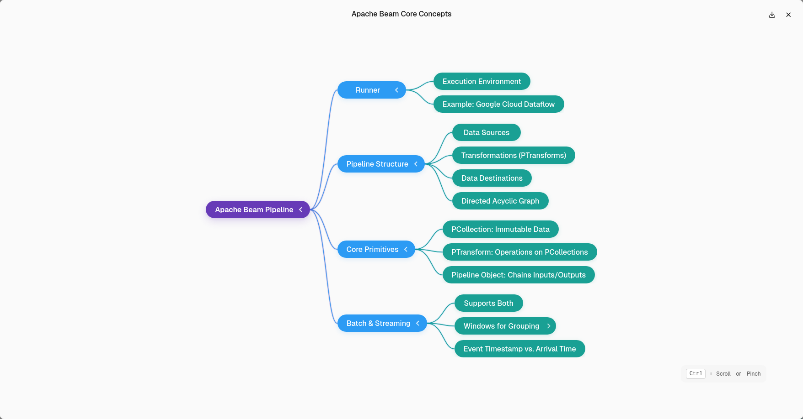

# Apache Beam Core Concepts

This document provides a technical overview of the core concepts in Apache Beam. These concepts form the foundational architecture that will guide data processing within the GeoNexus framework.

## 1. Overview of Apache Beam and the Runner Concept

Apache Beam defines a unified model for both batch and streaming data processing. A Beam pipeline consists of the following components:

- One or more data sources (inputs)
- A series of data transformations
- One or more data sinks (outputs)

This pipeline structure represents a **Directed Acyclic Graph (DAG)**, which models the flow of data through each transformation stage.

The **Runner** is the execution engine responsible for running the Beam pipeline. Examples of runners include Google Cloud Dataflow, Apache Flink, Apache Spark, and others. Beam pipelines can be executed in parallel across distributed systems, making them suitable for large-scale data processing.

Beam is designed with **portability** and **scalability** in mind. It supports multiple programming languages (including Python, Java, and Go) and a wide range of use cases, from simple data ingestion to real-time analytics and continuous data integration.

## 2. Core Pipeline Primitives

Apache Beam introduces three core abstractions for constructing pipelines:

### PCollection

A `PCollection` is an immutable, unordered collection of data elements. These elements can be either:

- **Bounded**: A finite collection (typical in batch processing)
- **Unbounded**: A potentially infinite collection (used in streaming data)

Every Beam pipeline begins and ends with one or more PCollections.

### PTransform

A `PTransform` represents a processing operation applied to one or more input PCollections and producing one or more output PCollections. Transformations can be composed into complex workflows and reused as modular components.

Common transforms include `ParDo` (parallel processing), `GroupByKey`, `Combine`, and `Flatten`.

### Pipeline

The `Pipeline` object connects all components and defines the relationships between PCollections and PTransforms. It acts as the container and execution context for the entire data workflow.

## 3. Handling Batch and Streaming Data with Windows

Apache Beam supports both batch and streaming data processing within the same unified programming model. When dealing with streaming data, additional complexity arises due to varying event times and data arrival delays.

To address this, Beam introduces the concept of **Windows**, which logically group elements in a PCollection based on event time.

### Timestamps

Each data element in a PCollection may carry a **timestamp** indicating when the event actually occurred. This timestamp may differ from the time the event was processed or ingested by the system. For example, events collected by mobile devices may be delayed if the device was offline.

### Windows

Windows define how data is logically grouped for processing over time. Beam provides several built-in windowing strategies:

- **Fixed Windows**: Group elements into non-overlapping, fixed-size time intervals (e.g., every 5 minutes).
- **Sliding Windows**: Similar to fixed windows, but they allow overlapping intervals (e.g., every 5 minutes with a 1-minute overlap).
- **Session Windows**: Dynamically group events based on activity or session gaps, useful for user interaction data.
- **Global Window**: A default window that includes all data, typically used in batch processing.

These windowing strategies enable developers to define meaningful aggregations and time-based processing operations over both bounded and unbounded datasets.

## 4. Execution Model

Beam pipelines are executed lazily by the selected runner. Each runner may implement its own optimizations and parallelization techniques. Beam abstracts away the execution logic so that the same pipeline can run on different runners with minimal code changes.

## 5. Integration with GeoNexus

In the context of the GeoNexus project, Apache Beam will serve as the core processing engine for geospatial data pipelines. It will enable scalable ingestion, transformation, and analysis of various geospatial formats such as FlatGeobuf, GeoTIFF, and others. The combination of Beam's flexibility and GeoNexus's spatial data capabilities will allow developers to build high-performance, distributed geospatial applications.

## Diagram

An illustration of the Apache Beam pipeline structure and data flow model is provided below:

---

**Document maintained as part of the GeXus open-source initiative.**
